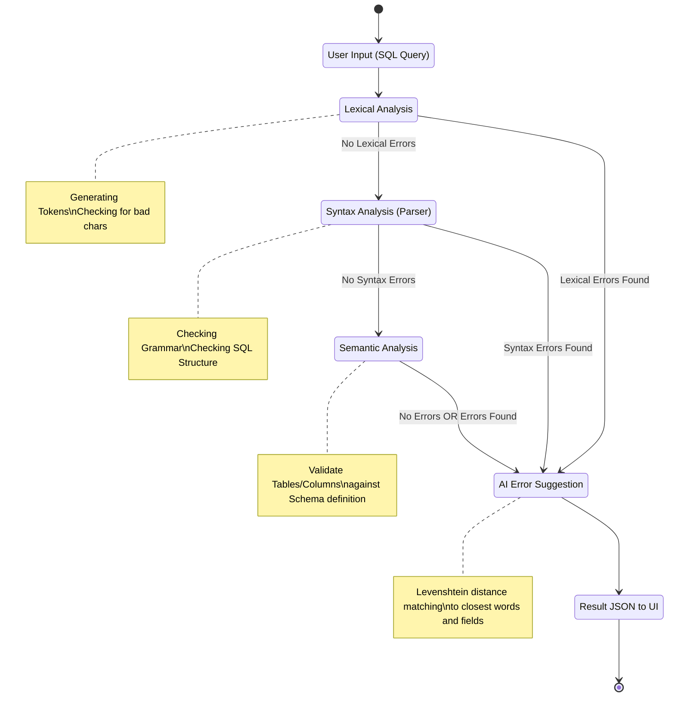

# Workflow Diagram

```mermaid
stateDiagram-v2
    [*] --> Input
    Input : User Input (SQL Query)
    
    Input --> Lexical
    Lexical : Lexical Analysis
    note right of Lexical: Generating Tokens\nChecking for bad chars
    
    Lexical --> Syntax : No Lexical Errors
    Lexical --> AI_Suggest : Lexical Errors Found
    
    Syntax : Syntax Analysis (Parser)
    note right of Syntax: Checking Grammar\nChecking SQL Structure
    
    Syntax --> Semantic : No Syntax Errors
    Syntax --> AI_Suggest : Syntax Errors Found
    
    Semantic : Semantic Analysis
    note right of Semantic: Validate Tables/Columns\nagainst Schema definition
    
    Semantic --> AI_Suggest : No Errors OR Errors Found
    
    AI_Suggest : AI Error Suggestion
    note right of AI_Suggest: Levenshtein distance matching\nto closest words and fields
    
    AI_Suggest --> Output
    Output : Result JSON to UI
    
    Output --> [*]
```
